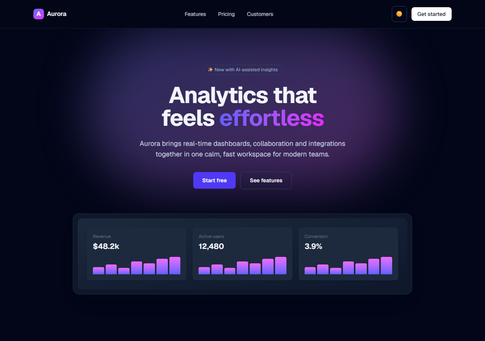

<!-- ══════════════════════════ TITLE ══════════════════════════ -->
<div align="center">
  
</div>

<!-- ══════════════════════ IDIOMAS / LANGUAGES ══════════════════════ -->
<div align="center">
<a href="README.md"></a>
<a href="README.en.md"></a>
<a href="README.es.md"></a>
</div>

<div align="center">


</div>

<div align="center">
<a href="#about"></a>
<a href="#uxui-highlights"></a>
<a href="#usage"></a>
</div>

<br/>

> ✨ **Aurora is a fictional product**, used to demonstrate landing-page design.

<div align="center">
  
</div>

## About

**Aurora** is a polished, animated product landing page showcasing UX/UI and front-end craft: light/dark theming with a toggle, scroll-reveal animations, a monthly/yearly pricing switch, and a fully responsive, accessible layout.

## UX/UI Highlights

- **Dark mode** with a toggle, persisted to `localStorage`, applied before paint to avoid flash (FOUC).
- **Scroll-reveal** animations via `IntersectionObserver` (no animation library).
- **Interactive pricing** with a monthly/yearly billing switch.
- **Design system** sensibilities: consistent spacing, gradient accents, hover states, balanced typography.
- Responsive from mobile to desktop; semantic, keyboard-friendly markup.

## Usage

```bash
npm install
npm run dev      # http://localhost:3000
```

## License

[MIT](LICENSE).

<div align="center">
  
</div>

<p align="center"><sub>Built by <strong><a href="https://github.com/geoggrigori">Grigori</a></strong> · 2026</sub></p>
